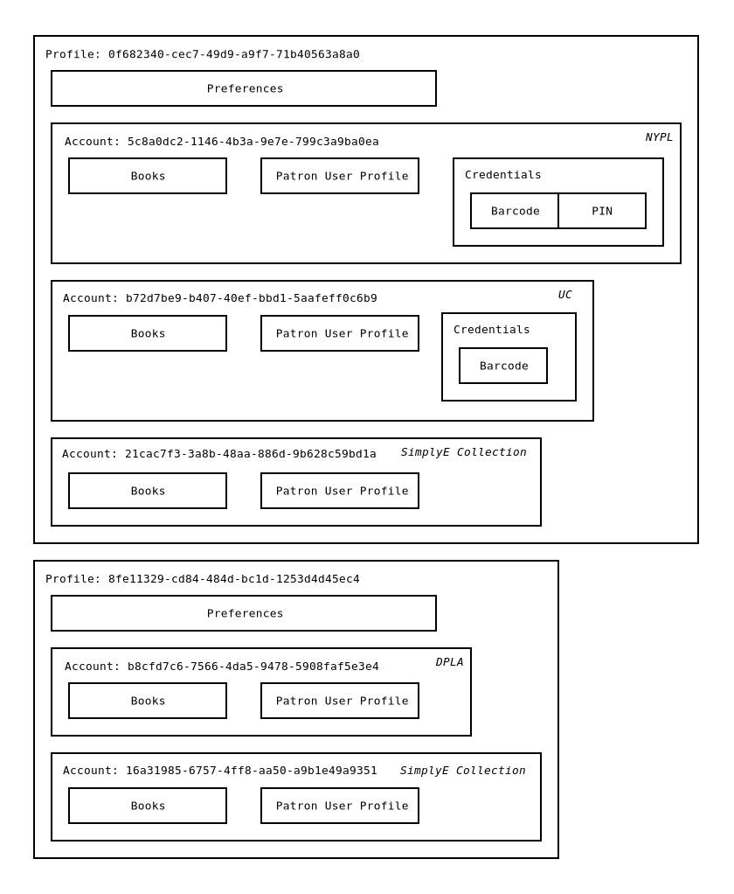

# Comparing Application And Patron Profiles

This document attempts to explain the differences between the Library Simplified
Android _application profiles_, and the _patron user profiles_ maintained on
the server side.

Application profiles were added to the Library Simplified Android codebase for
use in [Library For All's](https://libraryforall.org/) classroom deployments.

In the Library Simplified Android codebase, a _profile_ aggregates a set of
_accounts_ and also acts as a container for the user's _preferences_. There is 
always exactly one profile active at any given time, but there may be multiple
profiles present in the device's internal storage. Profiles have unique 
identifiers, but those identifiers are meaningless outside of the application.

An _account_ is largely synonymous with a _library_: An _account_ aggregates
a (possibly empty) collection of downloaded books, a _patron user profile_,
and some _credentials_ if the library in question requires them. Accounts,
like profiles, have unique identifiers and those identifiers are also
meaningless outside of the application.

There is a "has a" relationship between _profiles_ and _accounts_: A given
_profile_ has one or more _accounts_.

In builds of the codebase such as SimplyE and Open eBooks, a single profile
is created automatically when the user runs the application for the first time,
and there is no way for the user to switch profiles or even see that there's
such a thing as a "profile". In Library For All's builds of the codebase, the
user is prompted to either pick a profile from a list, or create a new one each
time the app starts up. The reason for having a single "anonymous" profile
present in SimplyE and Open eBooks is that it allows the codebase as a whole
to remain largely ignorant of whether the profile system is being used in
a user-visible manner or not; code simply works with "the currently active
profile" when it comes to manipulating accounts and preferences.

A _patron user profile_ is a piece of information maintained on the server
side, with each patron of a particular library having their own patron user
profile. The patron user profile currently stores settings such as whether or
not the patron has bookmark syncing enabled, and also delivers information such
as the types of DRM used by the library in question. The Android codebase
downloads this profile information whenever the user logs in to an _account_.
There is therefore a "has a" relationship between _accounts_ and _patron user profiles_:
An _account_ has exactly one _patron user profile_.

The following diagram shows the relationship between the various concepts:

There are two _profiles_ with identifiers `0f682340-cec7-49d9-a9f7-71b40563a8a0`
and `8fe11329-cd84-484d-bc1d-1253d4d45ec4`.

The first profile,
`0f682340-cec7-49d9-a9f7-71b40563a8a0`, has three accounts:
`5c8a0dc2-1146-4b3a-9e7e-799c3a9ba0ea`, `b72d7be9-b407-40ef-bbd1-5aafeff0c6b9`,
`21cac7f3-3a8b-48aa-886d-9b628c59bd1a`. In this example,
`0f682340-cec7-49d9-a9f7-71b40563a8a0` happens to be an NYPL account and
therefore there's a barcode and PIN present. The second account is
a University Of Colombia account and therefore only has a barcode. The last
account is a SimplyE Collection account and therefore has no credentials at
all.

The second profile has two accounts: `b8cfd7c6-7566-4da5-9478-5908faf5e3e4`, and
`16a31985-6757-4ff8-aa50-a9b1e49a9351`. These are DPLA and SimplyE Collection
accounts, respectively, and therefore have no credentials.
